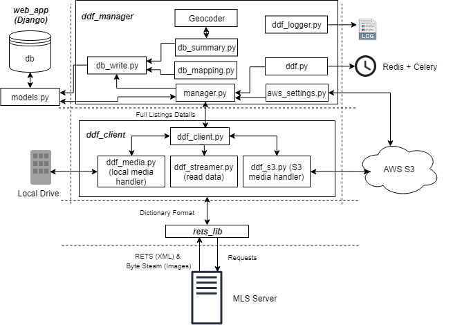

# Summary

'RETS_Manager' is a Django based platform for retrieving, storing, and syncing real-estate data and images from multiple listing service (MLS) servers. This platform was designed based on the Canadian Real Estate Association (CREA) Data Distribution Facility (DDF®) payload structure and can be easily modified to support any other MLS server. The platform converts the raw XML data of the MLS servers to a structure data in a PostgreSQL or SQLite database. It also supports storing media files either locally or on AWS S3 bucket. Additionally, the platform is ready for deployment as a Docker Container and it supports automation scheduled updates using Redis and Celery.    This end-to-end solution for real-estate data can be used by researchers to obtain a clean structured data for research related to housing prices trends, predictions and statistics. Also, it can be used as a backend for real-estate websites. The platform was tested using tens-of-thousands of real live data.

# Motivation and Significance in Research

Studying real-estate market trends is extremely popular. Real-estate market health has a significant impact on the economy, therefore, analyzing up-to-date real-estate data is vital and is performed by different agencies and parties. Several open-source databases were proposed for real-estate data such as [@yehDataset:2018] which was proposed by [@yeh2018building] and the dataset [@mohDataset:2018] which was proposed by [@rafiei2015novel]. Several Machine Learning papers have used the datasets [@yehDataset:2018] and [@rafiei2015novel] even though they are relatively small where they contain 412 and 372 instances, respectively. Using small open-source datasets can be a major disadvantage especially for image-based machine learning research. The idea of building image-based machine learning solution for housing appraisal is a new idea that has been proposed in the literature. Examples can be seen in [@you2017image] and [poursaeed2018vision]. In North America, real-estate transactional data is stored on multiple listing service (MLS) servers owned by different regional real-estate associations. The data is stored using an XML unified format knows as Real Estate Transaction Standard (RETS) [@RETS_STANDARD:2006]. Accessing MLS data requires an API key which is usually given to licensed realtors or organizations.  Converting the RETS XML data to structured data and confirming that all the transactions are synced correctly can be a daunting task. This proposed platform provides an end-to-end solution where researchers can retrieve all the transactional data into a clean structure dataset and the images into structured folders either locally or on the cloud. Therefore, researchers can build clean datasets which can include up to hundreds of thousands of transactional data and images that are ready to be utilized in research given they have the needed API key. 

# Platform Structure

The project was constructed based on CREA DDF's payload structure which is described in details under [@crea]. Therefore, it can be used directly without any modifications to build a dataset for the purpose of conducting research related to the Canadian housing market. Additionally, with minor modifications, the platform can support any MLS server world-wide. Testing was conducted using real live data by obtaining an API key through collaborating with a real-estate agent. However, the repository includes only the sample username and password provided by CREA for the purpose of testing as obtaining a full-access API keys requires approval from CREA.  The platform is constructed from multiple hierarchical models which converts the raw XML data obtained from MLS server to a fully synced structured database with synced images. Figure 1 illustrates the architecture of this platform. For applying RETS commands, a thin RETS client was imported and slighly modified [@refindlyllc]. The remaining parts of the projects are natively developed. The 'ddf_client' app is responsible on updating and syncing listing data and images from the MLS server using the then RETS client 'rets_lib'. To follow [@crea] guidelines, 'ddf_client' downloads all active records since the last update based on a timestamp. Then it requests a master-list of all the available listings ids. Finally, it download missing listings through request by id after comparing the database listings plus the received active listings againts the master-list. 'ddf_client' also downloads and syncs all the photos and identifies the removed listings. Additionally, the DDF API [@crea] limits the requests to 100 records each. The clients takes care of this issue as well by handling multiple requests to download all the available records. The 'ddf_manager' moves the data received by the 'ddf_client' to the database. 

# Figures

Figures can be included like this: 

# References
